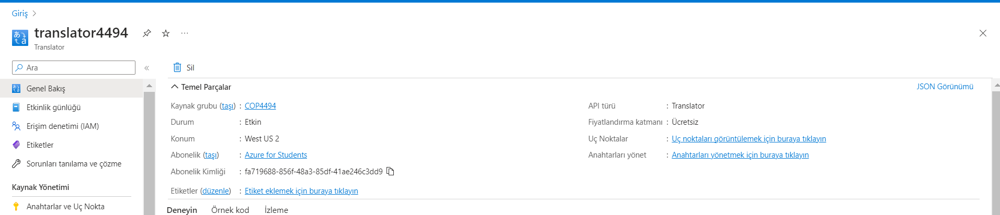
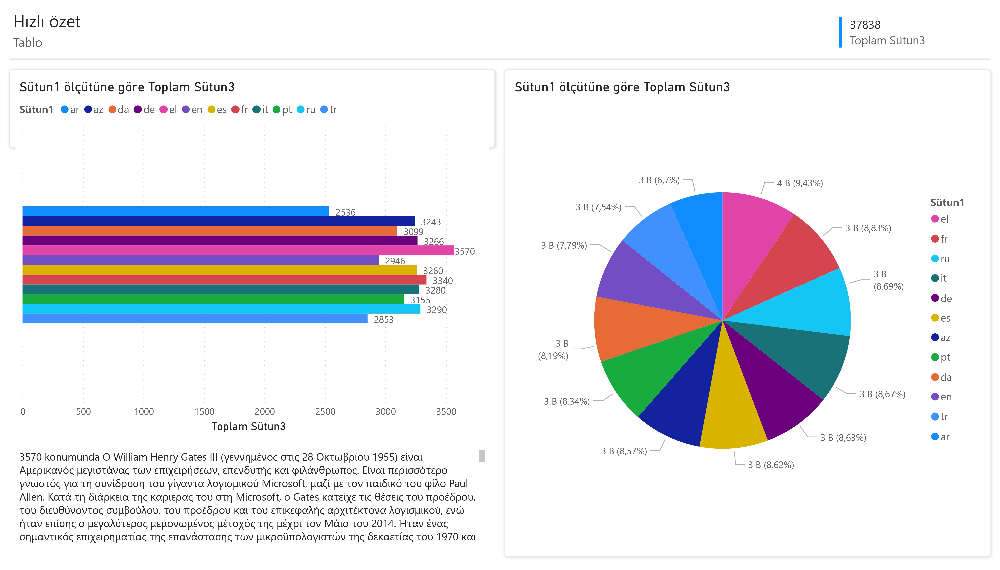

# Translator

## Purpose of the Project:

Purpose for this project is to see differences between various languages in terms of data size and count of words in a text.

## Description:

- In this project, I used *Translator SDK* and I created a resource group called *COP4494*.
    
- Then, I connected to Azure Translator SDK with Python code using API key.
- I take a text file in English as an input.
- Then, I sent this text to SDK to get translations in other languages.
- I saved the translations to a *CSV* file with their language codes.
- Then, I used Power BI for data virtualization.
- In this virtualization, I showed comparison of count of words with different languages.

## Github Repository Link:

https://github.com/begumtopaloglu90/Translator
